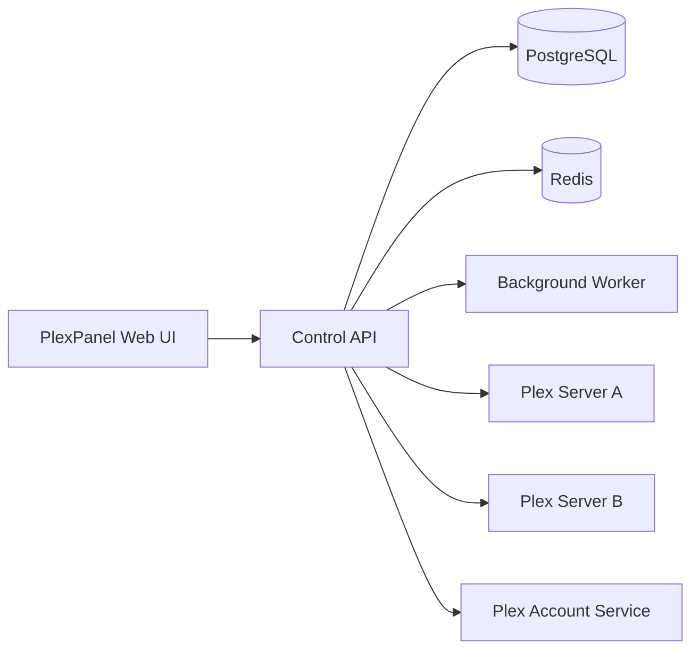

# PlexPanel

### Standalone, multi-server Plex operations from one control plane

**Multi-server Plex administration for library access, packages, resellers, scans, sessions, history, and operations—without proxying media.**

---

## Project status

PlexPanel is under active development. The first test release is being prepared on the `release/v0.1.0` branch.

The initial product scope intentionally excludes STRM generation, media mirroring, M3U/XMLTV ingestion, and Live TV configuration. It focuses on Plex server administration, library sharing, basic library scans, playback operations, packages, resellers, and account expiration.

## Planned v0.1.0 features

- Register and monitor multiple Plex Media Servers.
- Encrypt server and Plex account tokens.
- Import existing shared users.
- Invite Plex accounts and assign selected libraries.
- Manage customer expiration and suspension.
- Create packages with duration, stream limits, downloads, and credit cost.
- Master reseller, reseller, and sub-reseller accounts.
- Scan libraries, refresh metadata, empty trash, and schedule scans.
- Aggregate active playback sessions and history.
- Stop individual playback sessions.
- Optional simultaneous-stream enforcement, disabled by default.
- PostgreSQL, Redis, backup, diagnostics, repair, and audit workflows.

## Architecture

## Important Plex behavior

PlexPanel does not create local Plex passwords. Customers use their own Plex accounts and receive access to selected libraries through Plex sharing.

The server token used for share management must belong to the Plex account that owns the server. Restricted server-access tokens may be sufficient for basic monitoring but may not be able to invite or modify shared users.

## Disclaimer

PlexPanel is an independent project and is not affiliated with, endorsed by, or sponsored by Plex, Inc.

No media, television service, subscription service, or copyrighted content is included. Operators are responsible for their own hosting, Plex licensing, privacy policy, support terms, and authorization to manage or distribute content.
